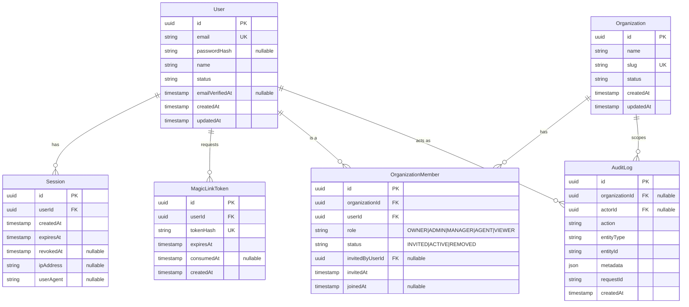

# Entity-Relationship Model

## Phase 1 entities (implemented now)

Constraints worth calling out:

- `OrganizationMember(organizationId, userId)` is unique — a user has at most one membership row per org.
- `Session.userId` is indexed; sessions are looked up by opaque session id (the cookie value), never enumerated.
- `AuditLog.organizationId` is nullable to allow account-level events (e.g. a user's own login) that aren't scoped to a single org; every org-scoped mutation writes a non-null row.

## Forward-look: tables introduced in later phases (not implemented yet)

Listed here so Phase 1's schema choices (naming, `organizationId` placement, id types) don't need to change when these land.

| Phase | Tables |
|---|---|
| 2 — Instagram/WhatsApp messaging | `ConnectedAccount`, `ProviderWebhookEvent`, `Contact`, `ContactIdentity`, `Conversation`, `ConversationParticipant`, `Message`, `OutboxEvent` |
| 3 — AI sales | `BusinessProfile`, `Product`, `Service`, `KnowledgeSource`, `KnowledgeDocument`, `KnowledgeDocumentVersion`, `KnowledgeChunk` (+ pgvector embedding column), `AIAgentConfig`, `AIUsage`, `ConversationSummary` |
| 4 — CRM | `Lead`, `Pipeline`, `PipelineStage`, `Activity`, `Task`, `Tag`, `LeadTag` |
| 5 — Follow-ups / automations | `FollowUp`, `Automation`, `AutomationExecution` |
| 6 — Content / TikTok | `ContentIdea`, `ContentPost`, `ContentAsset`, `ScheduledPost`, `PublishingExecution`, `MediaAsset` |
| 7 — Billing | `BillingCustomer`, `Subscription`, `SubscriptionItem`, `Entitlement`, `UsageCounter` |
| Cross-cutting | `Notification`, additional `AuditLog` action types |

Every table in this list is tenant-owned and will carry `organizationId` directly, per `docs/architecture/tenant-model.md`.
