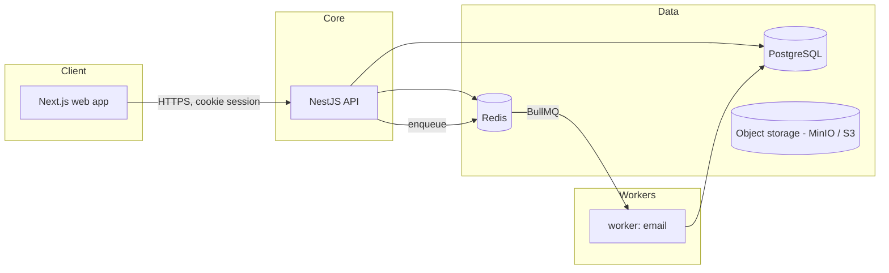
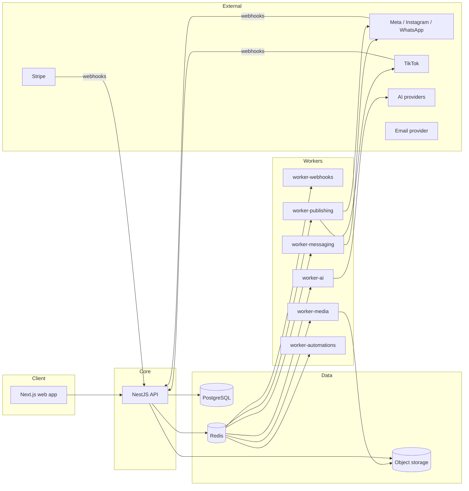

# Architecture Overview

## What this is

A multi-tenant SaaS ("AI Sales & Social Media Employee") built as a **modular monolith + independent background workers**, backed by PostgreSQL, Redis, and object storage. This document describes the system as it exists after Phase 1 (Foundation), plus the shape it grows into in later phases — so early decisions don't box in later ones.

## Why modular monolith, not microservices

At the target scale (1,000+ orgs, 10M+ messages over time), the bottleneck is almost never "we need independent services" — it's tenant isolation, data correctness, and idempotent processing under retries. A modular monolith with clean module boundaries gets us:

- one deployable unit to reason about, test, and operate with a small team
- transactional consistency within a bounded context (no distributed transactions for things like "create lead + write activity + emit event")
- the option to extract a module into its own service later *if measurement shows it needs independent scaling or failure isolation* (see `docs/adr/0001-modular-monolith.md`)

Background workers are already separate deployable processes from day one (see below), so the "needs independent scaling" concern is addressed without needing separate services for the request/response API surface.

## Components (Phase 1)

## Components (target shape, later phases)

## Responsibilities

- **`apps/web`** (Next.js): dashboard UI. Never talks to the database directly; only calls the API. No server secrets beyond what's needed for its own session handling.
- **`apps/api`** (NestJS): the modular monolith. Stateless — any instance can serve any request. Owns all writes to PostgreSQL for synchronous flows, enqueues async work to Redis/BullMQ, never calls an external provider or LLM synchronously inside a request that a user is waiting on for something that could instead be queued.
- **Workers**: independent processes, each consuming one or a few BullMQ queues. Scale independently of the API and of each other (e.g. `worker-ai` gets more replicas than `worker-media`). Phase 1 ships exactly one: a small email-sending worker, to prove the queue plumbing works end-to-end without inventing unrelated jobs.
- **PostgreSQL**: source of truth for everything. Every tenant-owned row carries `organizationId`.
- **Redis**: queues (BullMQ), rate limiting, short-lived coordination. Never the source of truth for business data.
- **Object storage**: media and generated assets (introduced when the Media/Content phases land). MinIO locally, S3-compatible in any environment.

## Statelessness

API and worker processes hold no in-memory session or business state between requests/jobs. Sessions live in PostgreSQL (`Session` table), rate-limit counters live in Redis, and everything else is fetched fresh per request/job. This is what makes horizontal scaling of the API and of each worker type a config change, not an architecture change.
